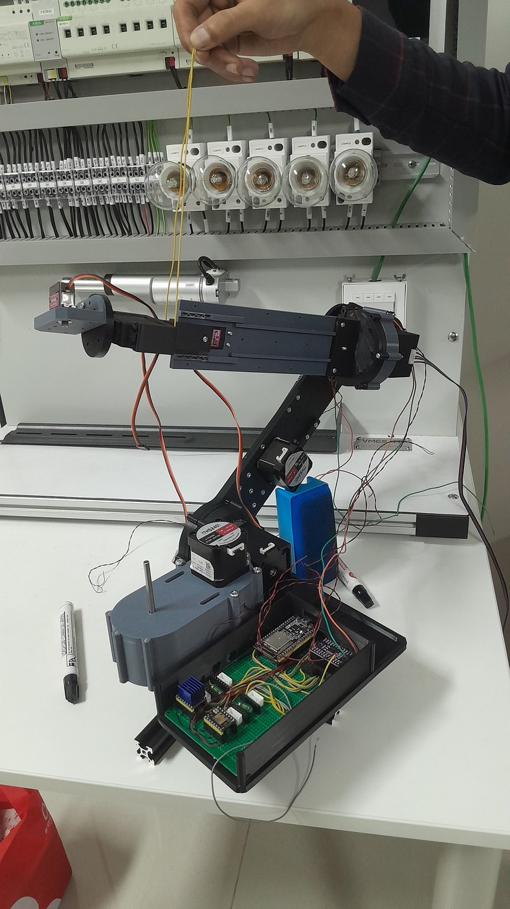
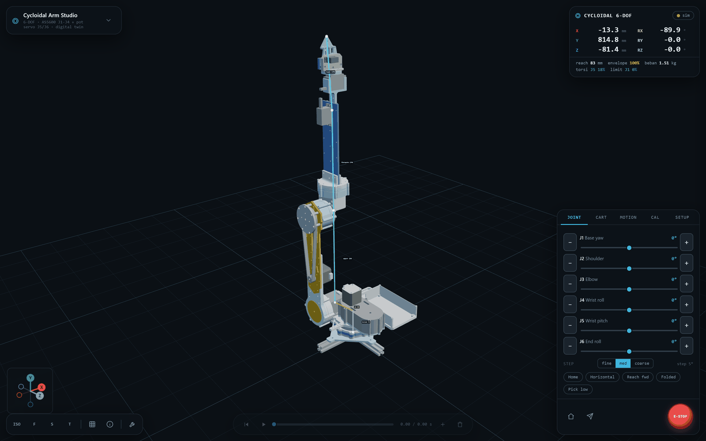
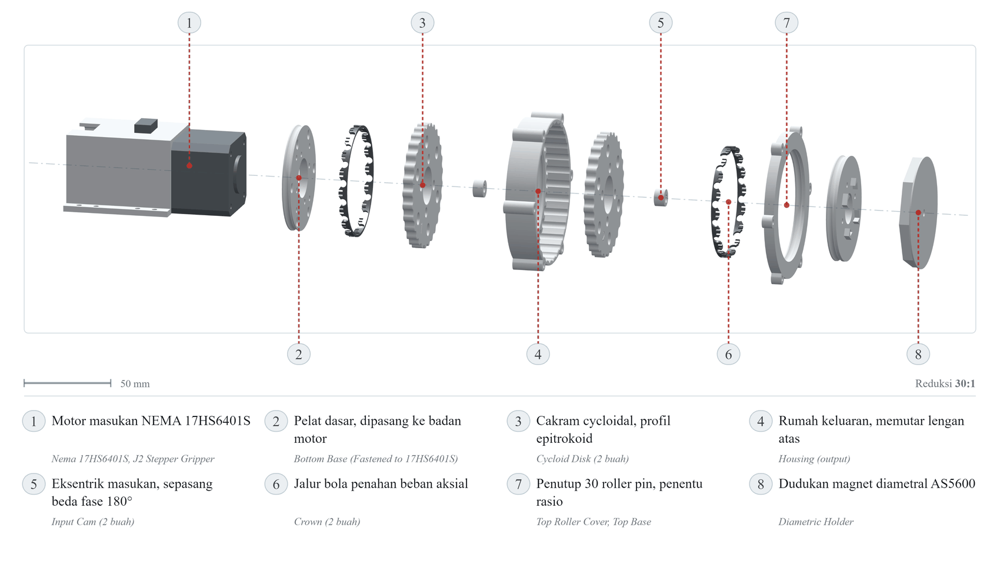
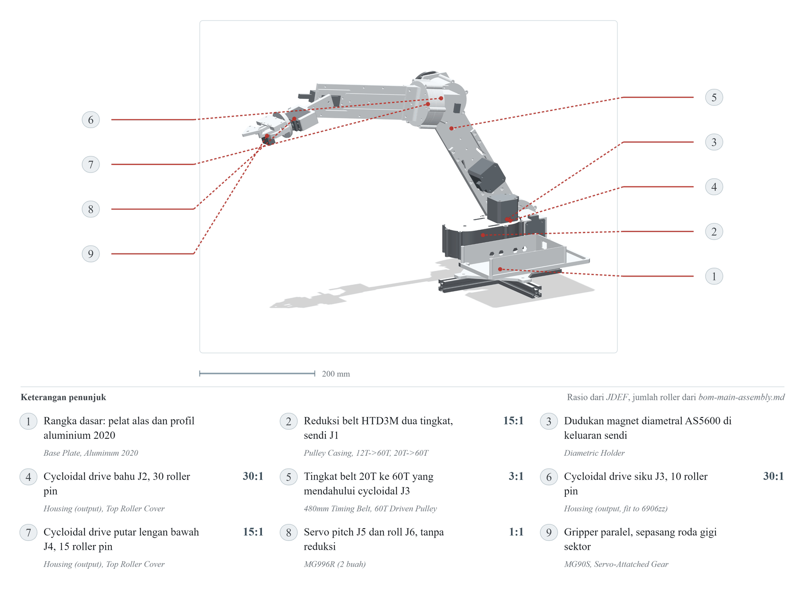
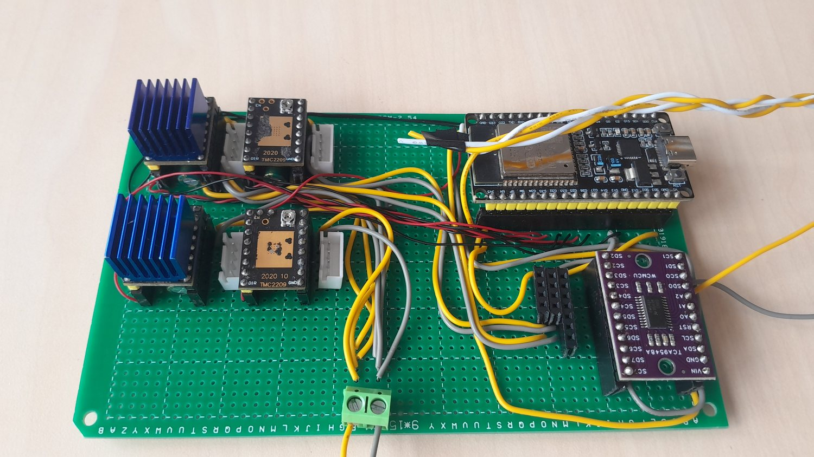

<h1 align="center">6-DOF 3D-Printed Robotic Arm</h1>

<p align="center">
  <b>Custom cycloidal drives &middot; closed-loop encoder feedback &middot; real-time web digital twin</b><br>
  <sub>Designed, printed, wired, and measured end to end. Every number below came off the bench.</sub>
</p>

<p align="center">
  <a href="https://github.com/kutilz/robotic-arm/actions/workflows/ci.yml"></a>
  <a href="LICENSE"></a>
  
  
</p>

<p align="center">
  
  &nbsp;&nbsp;
  
</p>
<p align="center"><sub>Left: the physical arm. Right: the browser digital twin mirroring it at 50 Hz.</sub></p>

---

## What this is

A six-axis robot arm whose gearboxes I designed and printed myself, instead of buying
them. Four joints run **custom cycloidal reducers** (15:1 and 30:1) driven by NEMA17
steppers; each one carries an **AS5600 magnetic encoder on the output shaft**, so the
firmware closes the loop on where the joint actually is rather than on how many steps it
was told to take. A browser-based digital twin mirrors the real arm over WebSocket, and
drives it back.

The interesting part is not that it moves. It is that **every design claim in this repo
has a measurement behind it** &mdash; and where the measurement disagreed with the design,
the measurement is what got written down.

---

## Measured results

Closed-loop feedback is the core contribution, so here is what it actually bought,
measured over 5 positions x 30 repeats per joint:

| Joint | Open loop | Closed loop | Improvement |
| ----- | --------- | ----------- | ----------- |
| J1 base yaw | 0.161&deg; | **0.084&deg;** | 1.9x |
| **J2 shoulder** | 0.683&deg; | **0.119&deg;** | **5.7x** |
| J3 elbow | 0.445&deg; | **0.097&deg;** | 4.6x |
| J4 wrist roll | 0.118&deg; | **0.068&deg;** | 1.7x |

<sub>Mean absolute positioning error. The heavier and more geared the joint, the more the
encoder matters &mdash; J2 carries the whole arm and gains the most.</sub>

| System | Measured | |
| ------ | -------- | --- |
| Digital twin round-trip latency | **50 ms** mean, 72 ms p95 | 50 Hz update rate |
| Firmware control loop | **4.3 ms** mean while moving | 6.1 ms p95 |
| J1 repeatability | **0.054&deg;** std dev | backlash 0.617&deg; |
| J2 output torque | **10.7 N&middot;m** measured | vs 7.9 N&middot;m datasheet prediction |
| Cycloidal efficiency | 63&ndash;66% (J2&ndash;J4), 94% (J1 belt) | design assumed 75% |
| Servo feedback linearity | **R&sup2; = 0.9999** | end-to-end error 0.59&ndash;1.33&deg; rms |

Raw data: [`benchmarks/`](benchmarks/) &middot; calibration procedure and traps:
[`firmware/kalibrasi.md`](firmware/kalibrasi.md)

---

## The mechanism

<p align="center"></p>

The shoulder reducer: two cycloidal discs 180&deg; out of phase on a shared eccentric,
30 roller pins setting the 30:1 ratio, and an AS5600 diametral magnet reading the output
directly. Printed in PLA+, with the pin circle upsized specifically on J2 to raise its
torque ceiling from ~13 to ~17 N&middot;m.

<p align="center"></p>

<p align="center"></p>
<p align="center"><sub>ESP32 + TMC2209 drivers + TCA9548A I2C mux, so four AS5600 encoders
that all share address 0x36 can be read on one bus.</sub></p>

---

## How it fits together

```
  Physical arm     4x NEMA17 + cycloidal   2x MG996R servo   4x AS5600 encoder
                          |                      |                  |
                   step/dir (TMC2209)          PWM            I2C via TCA9548A mux
                          |                      |                  |
                          +----------+-----------+---------+--------+
                                     |
  Firmware            ESP32  -  closed-loop position control, hosts its own WebSocket
                                     |          firmware/arm_controller_esp32/
                                     |  ws://<esp32>:81   JSON: goto / feedback / estop / cal
                                     |
  Digital twin        Browser  -  Three.js scene mirrors the real arm, and commands it
                                                studio/
```

The ESP32 serves its own WebSocket, so no laptop bridge is needed for real hardware.
The Python bridge (`src/arm/bridge.py`) is optional &mdash; it exists for `--simulate`
mode, which runs the whole digital twin with no hardware attached.

---

## Repository map

| Path | What is in it |
| ---- | ------------- |
| [`src/arm/`](src/arm/) | Python package: torque sizing, kinematics, optional simulation bridge |
| [`firmware/`](firmware/) | ESP32 sketch: closed-loop control, encoder read, NVS calibration, built-in web UI |
| [`studio/`](studio/) | Cycloidal Arm Studio &mdash; the Three.js digital twin, desktop and mobile |
| [`benchmarks/`](benchmarks/) | Every measurement in this README, raw and summarised |
| [`docs/research/`](docs/research/) | Sizing and drive-selection studies that justify the design |
| [`onshape/`](onshape/) | FeatureScript CAD source (the 3D model is generated, not committed) |
| [`tests/`](tests/) | Checks that the code agrees with the research documents |

---

## Try it without hardware

```bash
pip install -e ".[dev]"

python -m arm.torque      # print the motor/gearbox sizing table
pytest -q                 # 22 tests: code vs. research documents

python -m arm.bridge --simulate     # digital twin, no hardware
# then open studio/index.html and connect to ws://localhost:8765
```

With hardware, skip the bridge entirely and point the studio at `ws://<esp32-ip>:81`.

---

## Three things the bench taught me

**The closed loop was never running.** Closed-loop error measured *identical* to
open-loop error. The correction was real, but an `isRunning()` branch cancelled it before
it was ever applied. After the fix, every point landed inside the 0.3&deg; deadband
&mdash; 1.201&deg; rms down to 0.212&deg;.

**The ADC was reporting its own config register.** Three servo channels read
-1935.6 / -1423.6 / -911.6 mV. The tell was that consecutive channels differed by exactly
4096 counts: a pointer-register bug, not a wiring fault.

**A gear ratio cannot be measured through a narrow window.** Short sweeps put the J1
ratio anywhere from 15.14 to 15.59, all confidently wrong. Only a full revolution
resolves it to the designed 15 &mdash; the error has a once-per-turn component that a
narrow sweep reads as slope.

---

## Status and honest limits

Built and characterised; **J1&ndash;J4 closed-loop, J5/J6 servo with internal-pot
feedback**. Known limits, all measured rather than assumed:

- **J1 absolute accuracy is encoder-bound, not control-bound.** 1.4&deg; and 0.9&deg;
  error components at two and one cycles per revolution, with the AS5600 reporting
  `AGC` pinned at 128. That is a magnet-mounting problem; no amount of software fixes it.
  Repeatability (0.054&deg;) is unaffected.
- **J5 never truly holds still** &mdash; it carries the wrist and gripper against gravity
  and hunts continuously, with 500x the resting noise of J6.
- **Cycloidal efficiency came in below the 75% design assumption** (63&ndash;66%), which
  is why J2 sits closest to its torque margin.

Documentation throughout the repository is in Indonesian.

---

## License

[MIT](LICENSE). If this helps your research, a citation is appreciated &mdash; see
[`CITATION.cff`](CITATION.cff). Contributions welcome: [`CONTRIBUTING.md`](CONTRIBUTING.md).
